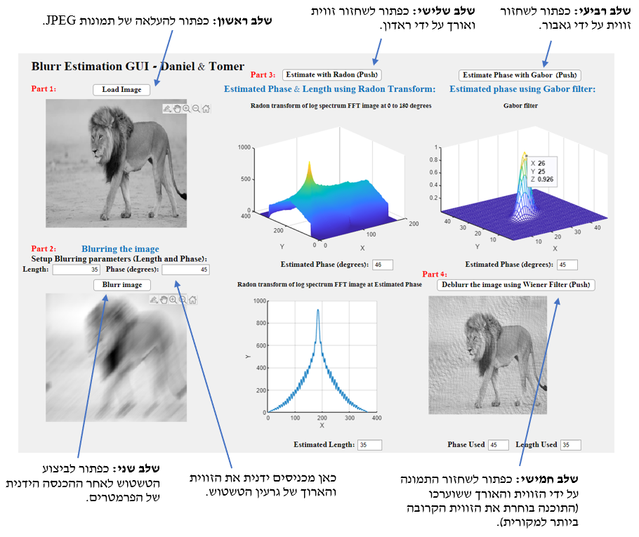

# Image Blur Estimation 

A Matlab GUI co - developed with another student as part of a Image Processing course assignment.

In this GUI we are uploading an image and applying a blurring filter with phase and length parameters.

Afterwards we estimate the length and the phase using the radon tranform and then 

we use another phase estimation technique using gabor filter. 

Lastly we take our estimated length and the closest estimated phase between 

the two techniques to the original phase parameter and deblur the image using wiener filter.

GUI inteface example and explenetaion:

# Binary Image Convertor

MATLAB app using GUI for converting image of a golf-ball to binary and measuring its diameter in pixels 

Binary Image Convertor And Ball Diameter Measurment.mlappinstall - main app

BinaryMeasurment_exported.m - raw code file
